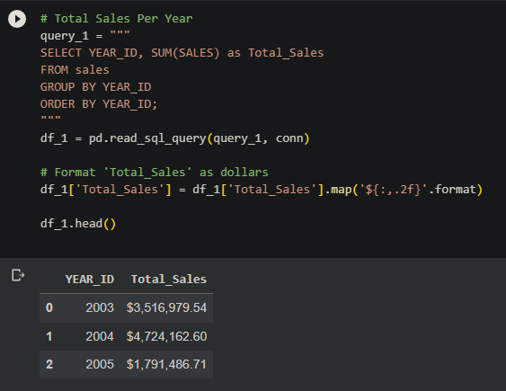
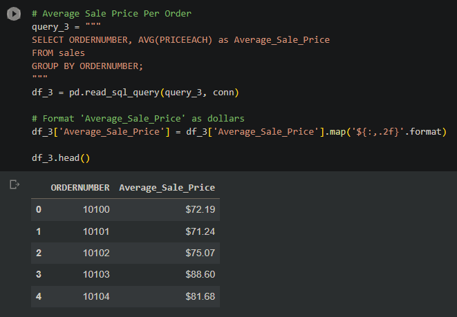
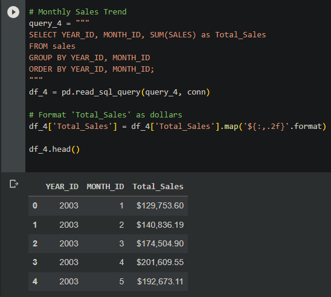
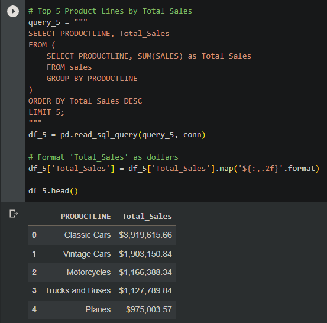
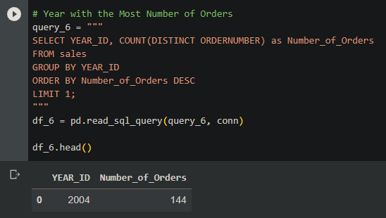

# Comprehensive Sales Analysis

## Objective

This project aims to extract and present actionable business insights from a sales dataset. By emphasizing the role of data in driving business decisions, I demonstrate the power of data analytics in shaping strategic and tactical business choices.

## Contents

- [Code](./code)
  - [Data Cleaning](./code/sales_data_clean_code.py)
  - [Data Transformation](./code/sales_data_clean_transformed_code.py)
  - [Data Analysis](./code/salesanalysiscode.ipynb)
- [Data](./data)
  - [Processed Data](./data/sales_data_clean.csv)
  - [Transformed Data](./data/sales_data_clean_transformed.csv)
  - [Original Dataset](./data/sales_data_sample.csv)
- [Visual Insights](./images)

## Data Insights

Through rigorous data analysis, this project unveils the nuances of sales trends, customer preferences, and product performance. Leveraging Python and SQL, I've distilled complex datasets into clear, actionable insights that can inform and guide business strategies.

## Data Preparation

- Initial preprocessing ensured the dataset's accuracy and relevance.
- Redundant fields were eliminated, and columns like prices were standardized to reflect the dollar currency.
- The 'orderdate' column underwent transformation into a datetime format, enabling time-based analyses.

## Analysis Platform

Google Colab, renowned for its intuitive interface and robust analytical capabilities, was the platform of choice. The dataset was integrated into an SQLite database within the Colab environment, ensuring seamless data querying and manipulations.

## Key Findings

1. **Annual Sales Trend**:
   - A notable sales increase of approximately $1 million was observed from 2003 to 2004.
   - A subsequent decline in 2005 can be attributed to the dataset's limitation, which only includes records up to May 2005.
     

2. **Top Customers**:
   - Euro Shopping Channel and Mini Gifts Distributors Ltd. stood out as major revenue drivers, highlighting them as potential key accounts for the business.

3. **Order Profitability**:
   - Analysis of the average sale price per order provided insights into transaction profitability, offering guidance for future pricing and discounting strategies.

4. **Monthly Sales Dynamics**:
   - A detailed month-wise sales analysis revealed patterns and seasonality, offering valuable insights for inventory management and marketing initiatives.

5. **Product Line Performance**:
   - Classic Cars dominated in terms of profitability, followed closely by Vintage Cars and Motorcycles. These insights are pivotal for inventory decisions and marketing campaigns.

6. **Order Volume Analysis**:
   - 2004 emerged as the year with the highest order volume, hinting at a possible peak in market demand or the success of marketing strategies during that period.

## Technical Implementation

The project was meticulously executed using Python within the Google Colab environment. The power of Pandas was harnessed for data manipulation, while SQLite provided an efficient querying platform. The cleaned dataset was integrated into an SQLite in-memory database, setting the stage for the extraction of the insights highlighted above.
