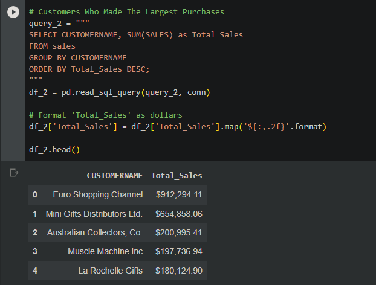

# Comprehensive Sales Analysis

## Objective

Extract and present actionable business insights from a sales dataset, emphasizing the role of data in driving business decisions.

## Contents

- [Code](./code)
  - [Data Cleaning](./code/sales_data_clean_code.py)
  - [Data Transformation](./code/sales_data_clean_transformed_code.py)
  - [Data Analysis](./code/salesanalysiscode.ipynb)
- [Data](./data)
  - [Processed Data](./data/sales_data_clean.csv)
  - [Transformed Data](./data/sales_data_clean_transformed.csv)
  - [Original Dataset](./data/sales_data_sample.csv)
- [Visual Insights](./images)
  - [Query Visualizations](./images)

## Data Insights

The project showcases the importance of data in understanding sales trends, customer behavior, and product performance. By leveraging Python and SQL, I've extracted insights that can guide business strategies and decisions.

## Data Preparation
- The dataset required initial preprocessing to ensure accuracy and relevance.
- Unnecessary fields were pruned to streamline the data, and specific columns like prices were formatted to reflect the dollar currency.
- The 'orderdate' column was transformed into a datetime format to facilitate time-based analyses.

## Analysis Platform
Google Colab was chosen as the primary platform due to its readability and user-friendly interface, especially when compared to tools like MySQL Workbench. The data was loaded into an SQLite database within the Colab environment.

## Key Findings

1. **Annual Sales Trend**:
   - Sales witnessed a significant surge of approximately $1 million from 2003 to 2004.
   - However, 2005 observed a dip, which can be attributed to the dataset only containing records up to May 2005.
     

2. **Top Customers**:
   - Euro Shopping Channel and Mini Gifts Distributors Ltd. emerged as the top contributors to the company's revenue, indicating potential key accounts.

3. **Order Profitability**:
   - The average sale price per order was analyzed to determine the profitability of each transaction. This metric can guide pricing and discounting strategies.

4. **Monthly Sales Dynamics**:
   - A month-wise breakdown of sales was conducted to identify seasonality and monthly sales patterns, crucial for inventory and marketing planning.

5. **Product Line Performance**:
   - Classic Cars emerged as the most lucrative product line, followed by Vintage Cars and Motorcycles. Such insights can inform product stocking and promotional strategies.

6. **Order Volume Analysis**:
   - 2004 was identified as the year with the highest number of orders, suggesting a potential peak in market demand or successful marketing campaigns during that period.

## Technical Implementation
The analysis was executed using Python within the Google Colab environment. Pandas was employed for data manipulation, while SQLite facilitated the querying process. The dataset, post-cleaning, was loaded into an SQLite in-memory database, and a series of SQL queries were executed to derive the aforementioned insights.

